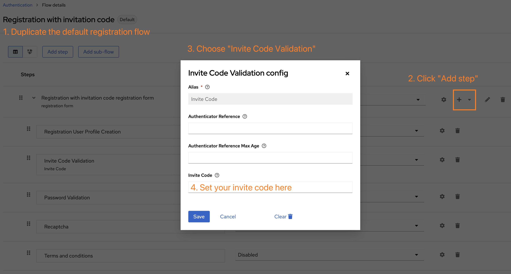

# Keycloak Registration with Invitation Code

This SPI (Service Provider Interface) implementation for Keycloak enables user registration using a predefined invitation code. It introduces an additional level of registration control by allowing **only individuals with a valid invite code, set by an administrator, to create an account**.

This implementation offers a simple and easy-to-configured method for restricting user registration to invite-only. It could also be an example of creating FormAction SPI with additional form fields defined in a custom theme.

## Compatibility

The implementation has been simply tested and confirmed to work with Keycloak version 24.0.1.

## Installation and Setup

To incorporate this feature into your Keycloak instance, follow the steps outlined below.

**Installation**

- Get the JAR file by downloading it or building it from source. Copy this file into the `providers` directory of your Keycloak installation.
- Execute `bin/kc.[sh|bat] build` to integrate the SPI into your Keycloak environment.

For keycload in docker, copy JAR file to `/opt/keycloak/providers` and run `docker exec <keycloak_container_name> /opt/keycloak/bin/kc.sh build && docker restart keycloak`.

**Configuration**

- Restart your Keycloak server. Post-restart, navigate to the **Provider Info** tab within the master realm's info page. Here, you should find `invite-code-validation` listed under the `form-action` section.

- Transition to the realm of interest. Under **Realm Settings > Themes**, modify the **Login theme** to `keycloak.withInviteCode` .

- Lastly, configure the authentication flow under **Authentication > Flows**. You need to duplicate the default registration flow and add step named "Invite Code Validation", and place it under the "Registration User Profile Creation" step. Below is an example configuration image:

  

## Additional Resources

For further assistance and resources related to this implementation, the following links might be helpful:

- [RedFroggy/keycloak-registration-invitation](https://github.com/RedFroggy/keycloak-registration-invitation)
- [Server Developer Guide (keycloak.org)](https://www.keycloak.org/docs/latest/server_development/#modifying-or-extending-the-registration-form): Official Keycloak documentation providing insights into form modification and extension, useful for developers looking to customize the registration process further.
