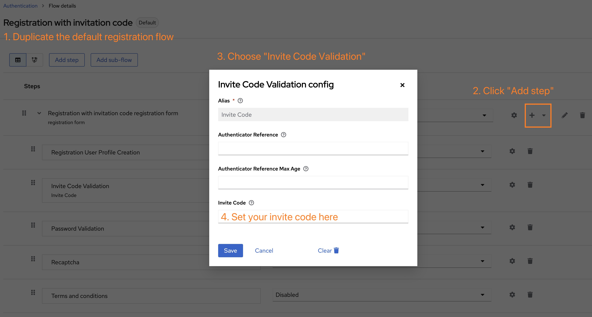

# Keycloak Registration with Invitation Code

This SPI (Service Provider Interface) implementation for Keycloak enables user registration with a predefined invitation code. It adds an extra registration control by allowing **only users with a valid invite code, set by an administrator, to create an account**.

This implementation offers a simple way to restrict user registration to invite-only access. It can also serve as an example of creating a FormAction SPI with additional form fields defined in a custom theme.

## Compatibility

This implementation has been tested and confirmed to work with Keycloak 26.6.2.

The SPI still uses Keycloak's `form-action` SPI. Keycloak reports this as an internal SPI at startup, so future Keycloak upgrades should be verified by rebuilding the provider and testing the registration flow again.

## Installation and Setup

To incorporate this feature into your Keycloak instance, follow the steps outlined below.

**Installation**

- Get the JAR file by downloading it or building it from source. Copy this file into the `providers` directory of your Keycloak installation.
- Execute `bin/kc.[sh|bat] build` to integrate the SPI into your Keycloak environment.

For Keycloak running in Docker, copy the JAR file to `/opt/keycloak/providers` and run `docker exec <keycloak_container_name> /opt/keycloak/bin/kc.sh build && docker restart <keycloak_container_name>`.

**Configuration**

- Restart your Keycloak server. After restart, navigate to the **Provider Info** tab within the master realm's info page. You should find `invite-code-validation` listed under the `form-action` section.

- Switch to the realm of interest. Under **Realm Settings > Themes**, set the **Login theme** to one of the bundled invite-code themes:
  - `keycloak.withInviteCode`: based on the classic Keycloak login theme.
  - `keycloak.v2.withInviteCode`: based on the Keycloak v2 login theme, tested with Keycloak 26.6.2.

- Lastly, configure the authentication flow under **Authentication > Flows**. Duplicate the default registration flow, add a step named "Invite Code Validation", and place it under the "Registration User Profile Creation" step. Below is an example configuration image:

  

## Additional Resources

For further assistance and resources related to this implementation, the following links might be helpful:

- [RedFroggy/keycloak-registration-invitation](https://github.com/RedFroggy/keycloak-registration-invitation)
- [Server Developer Guide (keycloak.org)](https://www.keycloak.org/docs/latest/server_development/#modifying-or-extending-the-registration-form): Official Keycloak documentation providing insights into form modification and extension, useful for developers looking to customize the registration process further.
